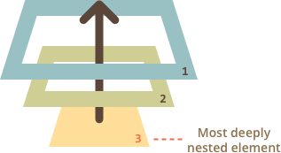

# Exam questions

<details>
<summary>1. What do we have when JavaScript runs in a web-browser?</summary>

> #### Answer:
> 
  
</details>

<details>
<summary>2. What's the window object?</summary>

> #### Answer:
>* It is a global object for JavaScript code
>* It represents the “browser window” and provides methods to control it
>* Top-level var variables and function declarations automatically become properties of `window`
>* The value of this in the global scope is `window`.

</details>

<details>
<summary>3. What's a global object for Javascript code?</summary>

> #### Answer:
>The global object provides variables and functions that are available anywhere. Mostly, the ones that are built into the language or the host environment.

</details>

<details>
<summary>4. What's DOM?</summary>

> #### Answer:
>It's the `D`ocument `O`bject `M`odel that defines the logical structure of documents and the way a document is accessed and manipulated.

</details>

<details>
<summary>5. What does DOM identify?</summary>

> #### Answer:
>* The interfaces and objects used to represent and manipulate a document;
>* The semantics of these interfaces and objects - including both behavior and attributes;
>* The relationships and collaborations among these interfaces and objects.

</details>

<details>
<summary>6. What's a graphical representation of the DOM?</summary>

> #### Answer:
>Documents have a logical structure which is very much like a tree. Each document contains zero or one doctype nodes,one root element node, and zero or more comments or processing instructions. The root element serves as the root of the element tree for the document.
>
>

</details>

<details>
<summary>7. What are DOM levels?</summary>

> #### Answer:
>`DOM` Levels are essentially versions. `DOM` Level 1 defines the core elements of the `D`ocument `O`bject `M`odel. `DOM` Level 2 extends those elements and adds events. `DOM` Level 3 extends `DOM` level 2 and adds more elements and events.

</details>

<details>
<summary>8. What are commonly used node types in DOM?</summary>
    
> #### Answer:
>There are 12 node types. In practice we usually work with 4 of them:
>* `document` – the “entry point” into `DOM`;
>* `element nodes` – `HTML`-tags, the tree building blocks;
>* `text nodes` – contain text;
>* `comments` – sometimes we can put the information there, it won’t be shown, but JS can read it from the `DOM`.

</details>

<details>
<summary>9. What's the document object?</summary>
    
> #### Answer:
>The `document` object gives access to the page content. We can change or create anything on the page using it.

</details>

<details>
<summary>10. How to travel between DOM nodes?</summary>

> #### Answer:
>

</details>

<details>
<summary>11. What are the topmost tree nodes that are available directly as document properties?</summary>

> #### Answer:
>* `document.documentElement` = <strong>\<html></strong>
>* `document.body` = <strong>\<body></strong>
>* `document.head` = <strong>\<head></strong>

</details>

<details>
<summary>12. What are child nodes?</summary>

> #### Answer:
>Child nodes (or children) – elements that are direct children. In other words, they are nested exactly in the given one. For instance, head and body are children of html element.

</details>

<details>
<summary>13.  What is descendants?</summary>

> #### Answer:
>Descendants are all elements that are nested in the given one, including children,their children and so on.

</details>

<details>
<summary>14.  Which child nodes does body tag have? 

```html
<html>
    <body>
        <div>Block</div>
        <ul>
            <li>
                <span>Text</span>
            </li>
        </ul>
    </body>
</html>
 ```
 </summary>

> #### Answer:
>body has children div and ul

</details>

<details>
<summary>15.  Which descendants does body tag have? 

```html
<html>
    <body>
        <div>Block</div>
        <ul>
            <li>
                <span>Text</span>
            </li>
        </ul>
    </body>
</html>
```
</summary>

> #### Answer:
>body has descendants div, ul,li, and span

</details>
    

<details>
<summary>16.  What are DOM collections?</summary>

> #### Answer:
>`DOM` collections look like arrays but actually they are not arrays. They are special array-like iterable objects.

</details>

<details>
<summary>17.  What are properties of DOM collections?</summary>

> #### Answer:
>* We can use for..of to iterate over them;
>* Array methods won't work, because they are not arrays;
>* They are read-only;
>* Almost all `DOM` collections with minor exceptions are live. In other words, they reflect the current state of `DOM`;
>* We can't use for..in to iterate over them.

</details>

<details>
<summary>18. What are childNodes?</summary>

> #### Answer:
>The `childNodes` is a `DOM` collection that provides access to all child nodes, including text nodes.

</details>

<details>
<summary>19. What's firstChild? </summary>

> #### Answer:
>`firstChild` gives fast access to the first children.
>```javascript
>elem.childNodes[0] === elem.firstChild
>```

</details>

<details>
<summary>20. What's lastChild? </summary>

> #### Answer:
>`lastChild` gives fast access to the last children.
>```javascript
>elem.childNodes[elem.childNodes.length - 1] === elem.lastChild
>```

</details>

<details>
<summary>21.  What are siblings? </summary>

> #### Answer:
>Siblings are nodes that are children of the same parent. For example body and head are siblings.
>
>```javascript
>document.head.nextSibling; // HTMLBodyElement
>document.body.previousSibling; // HTMLHeadElement
>```

</details>

<details>
<summary>22.  What are the parent? </summary>

> #### Answer:
>The parent is parent of child nodes and it's available as `parentNode`.
>```javascript
>document.body.parentNode === document.documentElement
>```

</details>


<details>
<summary>23.  What are navigation properties for element-only navigation?</summary> 

> #### Answer:
>* `children` – only those children that are element nodes;
>* `firstElementChild`, `lastElementChild` – first and last element children;
>* `previousElementSibling`, nextElementSibling – neighbour elements;
>* `parentElement` – parent element.

</details>

<details>
<summary>24.  Is there any difference between parentNode and parentElement? </summary>

> #### Answer:
>The `parentElement` property returns the 'element' parent, while parentNode returns any node parent. These properties are usually the same.
With the one exception of document.documentElement:
>```javascript
>    document.documentElement.parentNode; // document
>    document.documentElement.parentElement; // null
>```

</details>

<details>
<summary>25.  Which additional properties are provided to access table content?</summary>

> #### Answer:
>The table element supports these properties:
>* table.rows – the collection of <strong>\<tr></strong> elements of the table;
>* table.caption/tHead/tFoot – references to elements <strong>\<caption></strong>, <strong>\<thead></strong>, <strong>\<tfoot></strong>;
>* table.tBodies – the collection of <strong>\<tbody></strong> elements.

</details>
    
<details>
<summary>26.  How to find an element by id? </summary>

> #### Answer:
>```javascript
>    document.getElementById('id')
>```

</details>

<details>
<summary>27.  Can 'getElementById' be called on any element? </summary>

> #### Answer:
>The method `getElementById` that can be called only on document object. It looks for the given id in the whole document.

</details>

<details>
<summary>28. What will happen if there are multiple elements with the same id?</summary>

> #### Answer:
>The id must be unique. There can be only one element in the document with the given id. 
If there are multiple elements with the same id, then the behavior of corresponding methods is unpredictable. The browser may return any of them at random.

</details>

<details>
<summary>29.  Which else methods to look for nodes do you know? </summary>

> #### Answer:
>* `getElementsByName` - searches by name, can't be called on an element;
>* `getElementsByTagName` - searches by tag or '*', can be called on an element;
>* `getElementsByClassName` - searches by class, can be called on an element.

</details>

<details>
<summary>30.  What is querySelectorAll used for?</summary>

> #### Answer:
>The call to `elem.querySelectorAll(css)` returns all elements inside `elem` matching the given `CSS` selector.
>
>```javascript
>    document.querySelectorAll('ul > li:first-child')
>```

</details>

<details>
<summary>31.  What is querySelector used for?</summary>

> #### Answer:
>The call to `elem.querySelector(css)` returns the first element for the given `CSS` selector.

</details>

<details>
<summary>32.  Select the section with id container in a two ways? 

```html
<html>
    <body>
        <div id="container">Block</div>
        <ul>
            <li>
                <span>Text</span>
            </li>
        </ul>
    </body>
</html>
```
</summary>

> #### Answer:
>```javascript
>document.getElementById('container')
>document.querySelector('#container')
>```

</details>

<details>
<summary>33.  How to check if elem matches a given CSS selector?</summary> 

> #### Answer:
>The `elem.matches(css)` checks if elem matches the given `CSS` selector. It returns true or false.

</details>

<details>
<summary>34.  How to find the nearest ancestor that matches the given CSS-selector?</summary>

> #### Answer:
>The method `elem.closest(css)` looks the nearest ancestor that matches the `CSS` selector. The `elem` itself is also included in the search.

</details>

<details>
<summary>35. Which `DOM` node classes do you know? </summary>

> #### Answer:
>

</details>

<details>
<summary>36. Is there any difference between innerHTML and outerHTML?</summary>

> #### Answer:
>The `innerHTML` property allows to get and modify the HTML inside the element as a string.
The `outerHTML` property contains the full HTML of the element. That's like innerHTML plus the element itself.
Unlike `innerHTML`, writing to `outerHTML` does not change the element. Instead, it replaces it as a whole in the outer context.
The `outerHTML` assignment does not modify the `DOM` element, but extracts it from the outer context and inserts a new piece of `HTML` instead of it.

</details>

<details>
<summary>37. Which methods to work with attributes do you know? </summary>

> #### Answer:
>* `elem.hasAttribute(name)` – to check for existence;
>* `elem.getAttribute(name)` – to get the value;
>* `elem.setAttribute(name, value)` – to set the value;
>* `elem.removeAttribute(name)` – to remove the attribute;
>* `elem.attributes` is a collection of all attributes.

</details>

<details>
<summary>38. How to create a new element with the given tag? </summary>

> #### Answer:
>```javascript
>const newElement = document.createElement('div')
>```

</details>

<details>
<summary>39. How to create a new text node with the given text? </summary>

> #### Answer:
>```javascript
>cont newTextNode = document.createTextNode('New Text');
>```

</details>

<details>
<summary>40. Which insertion methods do you know?</summary>

> #### Answer:
>From the parent:
>
>* `parent.appendChild(node)`
>* `parent.insertBefore(node, nextSibling)`
>* `parent.removeChild(node)`
>* `parent.replaceChild(newElem, node)`
>
>All these methods return node.
>Given a list of nodes and strings:
>
>* `node.append(...nodes or strings)` – insert into node, at the end,
>* `node.prepend(...nodes or strings)` – insert into node, at the beginning,
>* `node.before(...nodes or strings)` – insert right before node,
>* `node.after(...nodes or strings)` – insert right after node,
>* `node.replaceWith(...nodes or strings)` – replace node.
>* `node.remove()` – remove the node.

</details>


<details>
<summary>41. How to append new li element with text 'Item 3' as the list child of the existing ul element? 
    
```html
<html>
<body>
    <div id="container">Block</div>
    <ul>
        <li>
            Item 1
        </li>
        <li>
            Item 2
        </li>
    </ul>
</body>
</html>
```
</summary>

> #### Answer:
>```javascript
>const listElement = document.querySelector('ul')
>
>const newListItemElement = document.createElement('li');
>newListItemElement.innerHTML = 'Item 3';
>
>listElement.appendChild(newListItemElement);
>```

</details>

<details>
<summary>42.  How to change background color of the ul element to red? 

```html
<html>
<body>
    <div id="container">Block</div>
    <ul>
        <li>
            Item 1
        </li>
        <li>
            Item 2
        </li>
    </ul>
</body>
</html>
```
</summary>

> #### Answer:
>```javascript
>const listElement = document.querySelector('ul')
>
>listElement.style.backgroundColor = 'red'
>```

</details>


<details>
<summary>43.  How to apply list class to the ul element?

```html
<html>
    <head>
        <style>
            .list{
                background-color: red;
            }
        </style>
    </head>
    <body>
        <div id="container">Block</div>
        <ul>
            <li>
                Item 1
            </li>
            <li>
                Item 2
            </li>
        </ul>
    </body>
</html>
```
</summary>

> #### Answer:
>```javascript
>const listElement = document.querySelector('ul')
>
>listElement.className = 'list'
>```

</details>

<details>
<summary>44.  How to apply list class to the ul element without rewriting customList class?

```html
<html>
    <head>
        <style>
            .list{
                background-color: red;
            }
            .customList{
                color: yellow;
            }
        </style>
    </head>
    <body>
        <div id="container">Block</div>
        <ul class="customList">
            <li>
                Item 1
            </li>
            <li>
                Item 2
            </li>
        </ul>
    </body>
</html>
```
</summary>

> #### Answer:
>```javascript
>const listElement = document.querySelector('ul')
>
>listElement.classList.add('list')
>```

</details>

<details>
<summary>45.  Which methods of classList do you know? </summary>

> #### Answer:
>* `elem.classList.add/remove("class")` – adds/removes the class;
>* `elem.classList.toggle("class")` – if the class exists, then removes it, otherwise adds it;
>* `elem.classList.contains("class")` – returns true/false, checks for the given class.

</details>

<details>
<summary>46.  What is getComputedStyle is used for?</summary> 

> #### Answer:
>The `style` property operates only on the value of the 'style' attribute, without any `CSS` cascade. So we can't read anything that comes from `CSS` classes using elem.style. In this case we can use `getComputedStyle(element[, pseudo])`. 
The result is an object with style properties, like elem.style, but now with respect to all `CSS` classes.

</details>

<details>
<summary>47.  Which geometry properties do elements have? </summary> 

> #### Answer:
>* `offsetParent` – is the nearest positioned ancestor or td, th, table, body.
>* `offsetLeft/offsetTop` – coordinates relative to the upper-left edge of offsetParent.
>* `offsetWidth/offsetHeight` – 'outer' width/height of an element including borders.
>* `clientLeft/clientTop` – the distance from the upper-left outer corner to its upper-left inner corner. For left-to-right OS they are always the widths of left/top borders. For right-to-left OS the vertical scrollbar is on the left so clientLeft includes its width too.
>* `clientWidth/clientHeight` – the width/height of the content including paddings, but without the scrollbar.
>* `scrollWidth/scrollHeight` – the width/height of the content including the scrolled out parts. Also includes paddings, but not the scrollbar.
>* `scrollLeft/scrollTop` – width/height of the scrolled out part of the element, starting from its upper-left corner.

</details>

<details>
<summary>48.  Is there any difference between clientWidth and CSS width?</summary> 

> #### Answer:
>* `clientWidth` is numeric, while `getComputedStyle(elem).width` returns a string with px at the end.
>* `getComputedStyle` may return non-numeric width like 'auto' for an inline element.
`clientWidth` is the inner content area of the element plus paddings, while `CSS` width (with standard box-sizing) is the inner content area without paddings.
>* If there’s a scrollbar and the browser reserves the space for it, some browser substract that space from `CSS` width, and some do not. The `clientWidth` property is always the same: scrollbar size is substracted if reserved.

</details>

<details>
<summary>49.  How to get the current scroll?</summary> 

> #### Answer:
>* Current scroll from the top: `window.pageYOffset`
>* Current scroll from the left: `window.pageXOffset`

</details>

<details>
<summary>50.  How to change the current scroll?</summary> 

> #### Answer:
>* `window.scrollTo(pageX,pageY)` – absolute coordinates;
>* `window.scrollBy(x,y)` – scroll relative the current place;
>* `elem.scrollIntoView(top)` – scroll to make elem visible (align with the top/bottom of the window).

</details>

<details>
<summary>51.  What's an event?</summary> 
    
> #### Answer:
>An event is a signal that something has happened.

</details>

<details>
<summary>52.  What's an event handler?</summary> 

> #### Answer:
>An event handler is a function that runs in case of an event.

</details>

<details>
<summary>53.  How to assign an event handler in 3 ways?</summary>

> #### Answer:
>* HTML attribute: `onclick="..."`;
>* DOM property: `elem.onclick = function`;
>* Methods: `elem.addEventListener(event, handler[, phase])` to add, `removeEventListener` to remove.

</details>

<details>
<summary>54.  What specifies whether the element is visible or not?</summary>
    
> #### Answer:
>The `hidden` attribute.

</details>

<details>
<summary>55.  How to toggle dive element with text on click by button?
    
```html
<html>
    <body>
        <div>
            Text
        </div>
        <button>
            Button
        </button>
    </body>
</html>
```

</summary>

> #### Answer:
>```javascript
>const buttonElement = document.querySelector('button')
>const textElement = document.querySelector('div')
>
>buttonElement.addEventListener('click', () => {
>    textElement.hidden = !textElement.hidden
>})
>```

</details>

<details>
<summary>56.  What's bubbling principle?</summary>

> #### Answer:
>When an event happens on an element, it first runs the handlers on it, then on its parent, then all the way up on other ancestors.
>
>

</details>

<details>
<summary>57.  What order will be of calling the event handlers if we click by p element?
    
```html
<form onclick="console.log('form')">FORM
    <div onclick="console.log('div')">DIV
        <p onclick="console.log('p')">P</p>
    </div>
</form>
```

</summary>

> #### Answer:
>```
>p
>div
>form
>```

</details>

<details>
<summary>58.  How to stop bubbling?</summary>

> #### Answer:
>`event.stopPropagation()`

</details>

<details>
<summary>59.  How to stop bubbling and prevent handlers on the current element from running?</summary>

> #### Answer:
>`event.stopImmediatePropagation()`

</details>

<details>
<summary>60.  Which phases of event propagation are exist?</summary>

> #### Answer:
>`* Capturing phase – the event goes down to the element;
>* Target phase – the event reached the target element;
>* Bubbling phase – the event bubbles up from the element.
>
>

</details>

<details>
<summary>61.  How to prevent browser actions?</summary>

> #### Answer:
>* Method `event.preventDefault()`.
>* If the handler is assigned using on event (not by addEventListener), then we can just return `false` from it.

</details>

<details>
<summary>62.  What's DOMContentLoaded event used for?</summary>

> #### Answer:
>`DOMContentLoaded` – the browser fully loaded HTML, and the DOM tree is built, but external resources like pictures <strong>\</strong> and stylesheets may be not yet loaded. `DOM` is ready, so the handler can lookup `DOM` nodes, initialize the interface.

</details>

<details>
<summary>63.  What's window.load event used for?</summary>

> #### Answer:
>The browser loaded all resources (images, styles etc). Additional resources are loaded, we can get image sizes (if not specified in `HTML`/`CSS`) etc.

</details>

<details>
<summary>64.  What are window.onunload and window.onbeforeunload events used for?</summary>

> #### Answer:
>They trigger when the user is leaving the page.
>* `beforeunload` event – the user is leaving: we can check if the user saved the changes and ask them whether they really want to leave.
>* `unload` – the user almost left, but we still can initiate some operations, such as sending out statistics

</details>

<details>
<summary>65.  What order will be of calling the event handlers?
    
```html
<script>
    document.addEventListener('DOMContentLoaded', () => console.log('DOMContentLoaded'));

    window.onload = () => console.log('window onload');
</script>


<script>
    img.onload = () => console.log('img onload');
</script>
```

</summary>

> #### Answer:
>```
>DOMContentLoaded
>img onload
>window onload
>```

</details>

<details>
<summary>66.  Which attributes for script tag don't block page rendering?</summary>

> #### Answer:
>`async` and `defer`

</details>

<details>
<summary>67.  Is there any difference between async and defer?</summary>

> #### Answer:
>* `async` - Load-first order. Their document order doesn't matter – which loads first. Irrelevant. May load and execute while the document has not yet been fully downloaded. That happens if scripts are small or cached, and the document is long enough.
>* `defer` - Document order (as they go in the document). Execute after the document is loaded and parsed (they wait if needed), right before `DOMContentLoaded`.


</details>

<details>
<summary>68.  What's BOM?</summary>

> #### Answer:
>`B`rowser `O`bject `M`odel are additional objects provided by the browser (host environment) to work with everything except the document.

</details>

<details>
<summary>69.  What's navigator object used for?</summary>

> #### Answer:
>The `navigator` object provides background information about the browser and the operating system. There are many properties, but the two most widely known are: `navigator.userAgent` – about the current browser, and `navigator.platform` – about the platform (can help to differ between Windows/Linux/Mac etc).

</details>

<details>
<summary>70.  What's location object used for?</summary>

> #### Answer:
>The `location` object allows us to read the current URL and can redirect the browser to a new one.

</details>

<details>
<summary>71.  How to redirect to another URL on click by button?

```html
<div>
    <button>
        Go
    </button>
</div>
```

</summary>

> #### Answer:
>```javascript
>const buttonElement = document.querySelector('button')
>
>buttonElement.addEventListener('click', () => {
>    location.href = 'https://www.wikipedia.org/'
>})
>```

</details>

<details>
<summary>72.  How to store data on the client side?</summary>

> #### Answer:
>* `cookies`
>* Web Storage
>* IndexedDB
>* Cache API
  
</details>

<details>
<summary>73.  What are cookies?</summary>

> #### Answer:
>`Cookies` are small strings of data that are stored directly in the browser. 

</details>

<details>
<summary>74.  How to read from cookies?</summary>

> #### Answer:
>```javascript
>document.cookie
>```

</details>

<details>
<summary>75.  How to write to cookies?</summary>

> #### Answer:
>```javascript
>document.cookie = "user=NewUser"
>```

</details>

<details>
<summary>76. Which web storages are exist?</summary>

> #### Answer:
>* localStorage
>* sessionStorage


</details>

<details>
<summary>77. What is localStorage used for?</summary>

> #### Answer:
>The main features of `localStorage` are:
>
>* Shared between all tabs and windows from the same origin.
>* The data does not expire. It remains after the browser restart and even OS reboot.

</details>

<details>
<summary>78. What is sessionStorage used for?</summary>

> #### Answer:
>* The `sessionStorage` exists only within the current browser tab.
>* Another tab with the same page will have a different storage.
>*  It is shared between iframes in the tab (assuming they come from the same origin).
>* The data survives page refresh, but not closing/opening the tab.

</details>

<details>
<summary>79. What's Web Storage API?</summary>

> #### Answer:
>* `setItem(key, value)` – store key/value pair.
>* `getItem(key)` – get the value by key.
>* `removeItem(key)` – remove the key with its value.
>* `clear()` – delete everything.
>* `key(index)` – get the key on a given position.
>* `length` – the number of stored items.


</details>

<details>
<summary>80. What's IndexedDB?</summary>

> #### Answer:
>`IndexedDB` is a built-in database, much more powerful than localStorage.

</details>

<details>
<summary>81. What are advantages of IndexedDB?</summary>

> #### Answer:
>* IndexedDB is a key/value storage;
>* IndexedDB supports transactions for reliability;
>* IndexedDB supports key range queries, indexes;
>* IndexedDB can store much more data than localStorage.

</details>

<details>
<summary>82. What's Cache API used for?</summary>

> #### Answer:
>This API is designed for storing `HTTP` responses to specific requests, and is very useful for doing things like storing website assets offline so the site can subsequently be used without a network connection.

</details>

<details>
<summary>83. What's HTTP?</summary>

> #### Answer:
>`HTTP` is a protocol which allows the fetching of resources, such as HTML documents.

</details>

<details>
<summary>84. What do HTTP requests consist of?</summary>

> #### Answer:
>

</details>

<details>
<summary>85. What do HTTP responses consist of?</summary>

> #### Answer:
>

</details>

<details>
<summary>86. What are HTTP methods exist?</summary>

> #### Answer:
>GET, POST, HEAD, PUT, DELETE, CONNECT, OPTIONS, TRACE
   
</details>

<details>
<summary>87.  What are `HTTP` status codes exist?</summary>

> #### Answer:
>| Code | Name                   |
>| ---- | ---------------------- |
>| 10*  | Information responses  |
>| 20*  | Successful responses   |
>| 30*  | Redirection messages   |
>| 40*  | Client error responses |
>| 50*  | Server error responses |

</details>

<details>
<summary>88.  What's HTTPS?</summary>

> #### Answer:
>`HTTPS` is an extension of the `HTTP`. It is used for secure communication over a computer network, and is widely used on the Internet. In `HTTPS`, the communication protocol is encrypted using `T`ransport `L`ayer `S`ecurity (`TLS`), or, formerly, its predecessor, `S`ecure `S`ockets `L`ayer (`SSL`). The protocol is therefore also often referred to as `HTTP` over `TLS`, or `HTTP` over `SSL`.

</details>

<details>
<summary>89.  What's JSON?</summary>

> #### Answer:
>* `JSON` is `J`avaScript `O`bject `N`otation;
>* `JSON` is a lightweight format for storing and transporting data;
>* `JSON` is often used when data is sent from a server to a web page;
>* `JSON` is "self-describing" and easy to understand.
  
</details>

<details>
<summary>90.  What are JSON syntax rules?</summary>

> #### Answer:
>* Data is in name/value pairs;
>* Data is separated by commas;
>* Curly braces hold objects;
>* Square brackets hold arrays.

</details>

<details>
<summary>91.  How to convert JSON string to a JavaScript object?</summary>

> #### Answer:
>```javascript
>const text = '{"result":true, "count":42}';
>const obj = JSON.parse(text);
>```

</details>

<details>
<summary>92.  How to convert JavaScript object to JSON string? </summary>

> #### Answer:
>```javascript
>JSON.stringify({ x: 5, y: 6 })
>```

</details>

<details>
<summary>93.  What are valid data types of JSON? </summary>

> #### Answer:
>* a string;
>* a number;
>* an object (`JSON` object);
>* an array;
>* a boolean;
>* null.
    
</details>

<details>
<summary>94.  Which data types we can't use in JSON?</summary>

> #### Answer:
>* a function;
>* a date;
>* undefined.
    
</details>

<details>
<summary>95.  What's XML?</summary>

> #### Answer:
>* `XML` stands for e`X`tensible `M`arkup `L`anguage;
>* `XML` is a markup language much like HTML;
>* `XML` was designed to store and transport data.
    
</details>

<details>
<summary>96. Is there any difference between JSON and XML?</summary>

> #### Answer:
>* `JSON` doesn't use end tag;
>* `JSON` is shorter;
>* `JSON` is quicker to read and write;
>* `JSON` can use arrays;
>* `XML` has to be parsed with an `XML` parser. `JSON` can be parsed by a standard JavaScript function.
    
</details>

<details>
<summary>97. Which types of network requests are exist?</summary>

> #### Answer:
>* XMLHttpRequest
>* AJAX
>* Fetch API

</details>

<details>
<summary>98. What's XMLHttpRequest?</summary>

> #### Answer:
>The `XMLHttpRequest` object can be used to request data from a web server.
    
</details>

<details>
<summary>99. What's the basic flow of XMLHttpRequest in asynchronous mode?</summary>
    
> #### Answer:
>* Сreate XMLHttpRequest.
>    
>```javascript
>let xhr = new XMLHttpRequest(); // no arguments
>```
>
>* Initialize it.
>
>```javascript
>xhr.open(method, URL, [async, user, password])
>```
>
>* Send it out.
>    
>```javascript
>xhr.send([body])
>```
>
>* Listen to events for response.
>
>```javascript
>xhr.onload = function() {
>};
>
>xhr.onerror = function() {
>};
>```
    
</details>

<details>
<summary>100.  What's fetch?</summary>

> #### Answer:
>Method `fetch()` is the modern way of sending requests over `HTTP`. The browser starts the request right away and returns a promise.
Getting a response is usually a two-stage process.    The promise resolves with an object of the built-in Response class as soon as the server responds with headers.
    
</details>

<details>
<summary>101.   What's basic syntax of fetch?</summary>

> #### Answer:
>```javascript
>let response = await fetch(url, options);
>```

</details>

<details>
<summary>102.   What's AJAX?</summary>

> #### Answer:
>``AJAX` is `A`synchronous `J`avaScript And `X`ML. 
`AJAX` just uses a combination of:
>
>* A browser built-in `XMLHttpRequest` object (to request data from a web server);
>* JavaScript and `HTML` `DOM` (to display or use the data).

</details>

<details>
<summary>103.   How does AJAX work?</summary>

> #### Answer:
>

</details>

<details>
<summary>104.   Might `AJAX` use `JSON` text to transport data?</summary>

> #### Answer:
>`AJAX` is a misleading name. `AJAX` applications might use `XML` to transport data, but it is equally common to transport data as plain text or `JSON` text.

</details>

<br/>

**[⬆ back to top](#exam-questions)**
