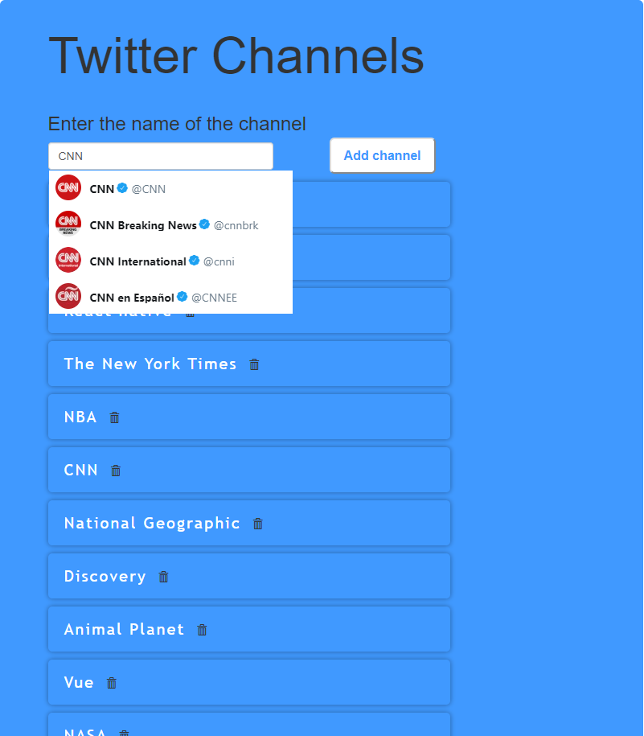
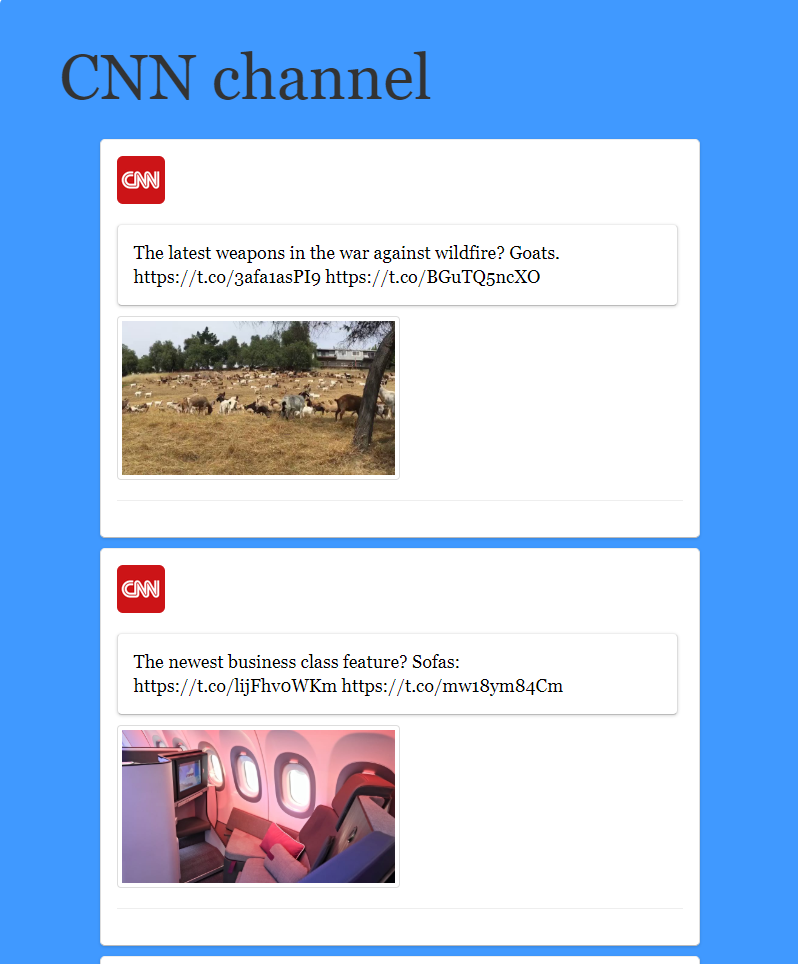
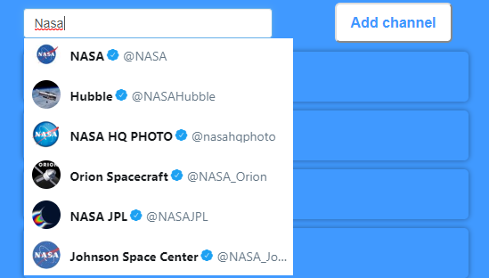
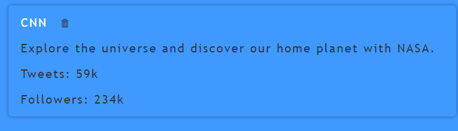
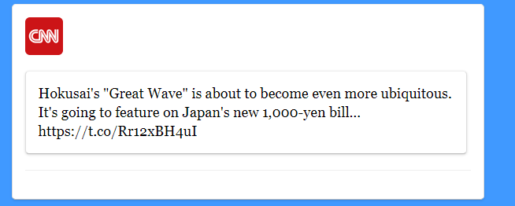
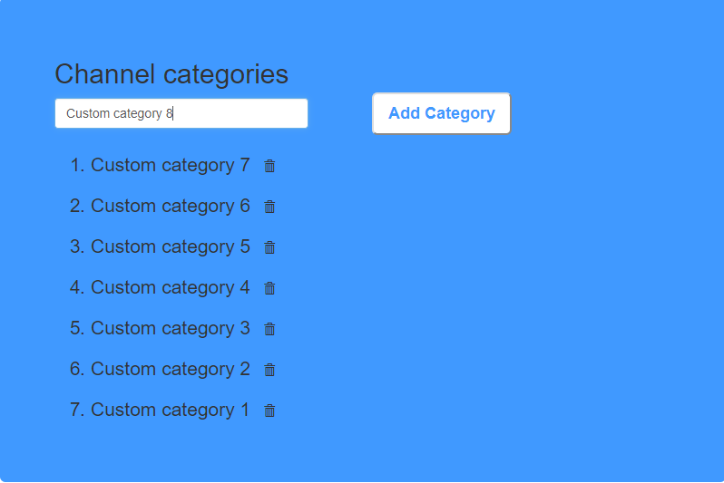
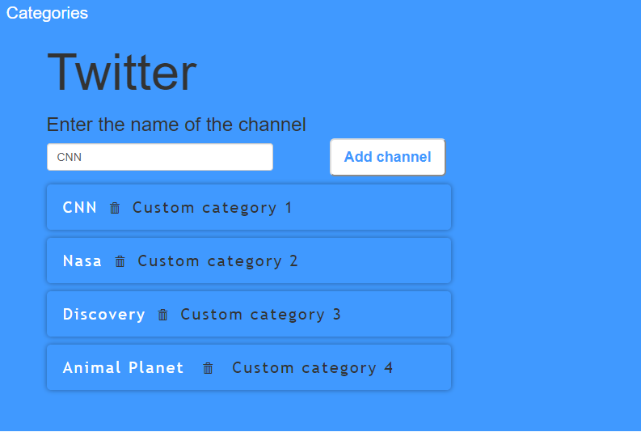

# Twitter Channels Search

## Short Description

Create a Web Application to search Twitter channels and displaying their tweets.

## Estimation (h)

54

## Topics

- Document
- Browser Events
- Local Storage
- HTTP
- JSON
- XMLHttpRequest
- Fetch API

## Requirements

* Create a Web application with an ability to search, add, remove and display Twitter channels as a list and displaying tweets for any selected channel. Use Twitter REST API for data retrieving.

### Autosuggest search input

Implement an autosuggest search input which is updated on every typed character and provides the user with the result of the first 5 founded channels, an example:

### Channel

Display information about every channel, an example:

1. Each channel should have information about:
    - Name
    - Description
    - Number of tweets
    - Number of followers

2. Channel can be removed by clicking the trash icon.

### Tweet

Display information about every tweet, an example:

Each tweet should have a description and image (if attached).

### Restrictions **(do not apply to advanced requirements)**

1. Use only JavaScript DOM to access and manipulate the elements on an HTML document. Using of JQuery and other libraries that are intended to simplify interaction with DOM is prohibited.
2. Use XMLHttpRequest Object to perform HTTP requests.

## Advanced Requirements

1. Use Local Storage to persist and display added channels after the page being reloaded.
2. Use fetch instead of XMLHttpRequest across the application.
3. Create a page of categories with an ability to add and display channels category. Implement the logic of binding a category to a channel.

