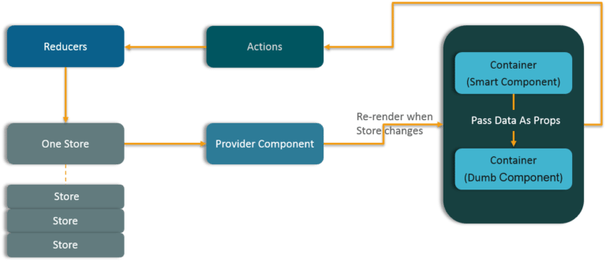

# Exam questions

## Pure React

<details>
<summary>1. What is the difference between Element and Component?</summary>

>#### Answer:
>An **element** is a plain object describing what you want to appear on the screen in terms of the DOM nodes or other components.
>Elements can contain other Elements in their props. Creating a React element is cheap. Once an element is created,
>it is never mutated.
>
>The object representation of React element would be as follows:
>
>```javascript
>const element = React.createElement(
>  'div',
>  {id: 'login-btn'},
>  'Login'
>)
>```
>
>The above `React.createElement()` function returns an object:
>
>```javascript
>{
>  type: 'div',
>  props: {
>    children: 'Login',
>    id: 'login-btn'
>  }
>}
>```
>
>And finally it renders to the DOM using ReactDOM.render():
>
>```jsx harmony
><div id='login-btn'>Login</div>
>```
>
>Whereas a **component** can be declared in several different ways. It can be a class with a `render()` method.
>Alternatively, in >simple cases, it can be defined as a function. In either case, it takes props as an input,
>and returns a JSX tree as the output:
>
>```jsx harmony
>const Button = ({ onLogin }) =>
>  <div id={'login-btn'} onClick={onLogin} />
>```
>
>Then JSX gets transpiled to a `React.createElement()` function tree:
>
>```javascript
>const Button = ({ onLogin }) => React.createElement(
>  'div',
>  { id: 'login-btn', onClick: onLogin },
>  'Login'
>)
>```
</details>

<details>
<summary>2. Why is it necessary to capitalize component names?</summary>

>#### Answer:
>It is necessary because components are not DOM elements, they are constructors.
>Also, in JSX lowercase tag names are referring to HTML elements, not components.
</details>

<details>
<summary>3. Why React uses className over class attribute?</summary>

>#### Answer:
>`class` is a keyword in JavaScript, and JSX is an extension of JavaScript.
>That's the principal reason why React uses `className` instead of `class`.
</details>

<details>
<summary>4. Differentiate between Real DOM and Virtual DOM.</summary>

>#### Answer:
>| Real DOM                                 | Virtual  DOM                           |
>|------------------------------------------|----------------------------------------|
>| 1. It updates slow.                      | 1. It updates faster.                  |
>| 2. Can directly update HTML.             | 2. Can’t directly update HTML.         |
>| 3. Creates a new DOM if element updates. | 3. Updates the JSX if element updates. |
>| 4. DOM manipulation is very expensive.   | 4. DOM manipulation is very easy.      |
>| 5. Too much of memory wastage.           | 5. No memory wastage.                  |
</details>

<details>
<summary>5. What are the different phases of React component’s lifecycle?</summary>

>#### Answer:
>There are three different phases of React component’s lifecycle:
>
>* Initial Rendering Phase: This is the phase when the component is about to start its life journey and make its way to the DOM.
>* Updating Phase: Once the component gets added to the DOM, it can potentially update and re-render only when a prop or state
>change occurs. That happens only in this phase.
>* Unmounting Phase: This is the final phase of a component’s life cycle in which the component is destroyed and removed from
>the DOM.
</details>

<details>
<summary>6. Is `setState()` is async? Why is `setState()` in React async instead of sync?</summary>

>#### Answer:
>`setState()` actions are asynchronous and are batched for performance gains. This is explained in documentation as below.
>
>`setState()` does not immediately mutate this.state but creates a pending state transition.
>Accessing this.state after calling this method can potentially return the existing value.
>There is no guarantee of synchronous operation of calls to `setState` and calls may be batched for performance gains.
>
>This is because `setState` alters the state and causes rerendering. This can be an expensive operation and making it
>synchronous might leave the browser unresponsive. Thus the `setState` calls are asynchronous as well as batched for better
>UI experience and performance.
</details>

<details>
<summary>7. What is the second argument that can optionally be passed to `setState()` and what is its purpose?</summary>

>#### Answer:
>A callback function which will be invoked when `setState` has finished and the component is re-rendered.
>
>Since the setState is asynchronous, which is why it takes in a second callback function. With this function,
>we can do what we want immediately after state has been updated.
</details>

<details>
<summary>8. How to listen to state changes?</summary>

>#### Answer:
>The following lifecycle methods will be called when state changes. You can compare provided state and props values with
>current state and props to determine if something meaningful changed.
>
>```javascript
>componentWillUpdate(object nextProps, object nextState)
>componentDidUpdate(object prevProps, object prevState)
>```
</details>

<details>
<summary>9. Explain the lifecycle methods of React components in detail.</summary>

>#### Answer:
>Some of the most important lifecycle methods are:
>
>* `componentWillMount()` – Executed just before rendering takes place both on the client as well as server-side.
>* `componentDidMount()` – Executed on the client side only after the first render.
>* `componentWillReceiveProps()` – Invoked as soon as the props are received from the parent class and before another render
>is called.
>* `shouldComponentUpdate()` – Returns true or false value based on certain conditions. If you want your component to update,
>return true else return false. By default, it returns false.
>* `componentWillUpdate()` – Called just before rendering takes place in the DOM.
>* `componentDidUpdate()` – Called immediately after rendering takes place.
>* `componentWillUnmount()` – Called after the component is unmounted from the DOM. It is used to clear up the memory spaces.
</details>

<details>
<summary>10. What is an event in React?</summary>

>#### Answer:
>In React, events are the triggered reactions to specific actions like mouse hover, mouse click, key press, etc.
>Handling these events are similar to handling events in DOM elements. But there are some syntactical differences like:
>
>* Events are named using camel case instead of just using the lowercase.
>* Events are passed as functions instead of strings.
>
>The event argument contains a set of properties, which are specific to an event.
>Each event type contains its own properties and behavior which can be accessed via its event handler only.
</details>

<details>
<summary>11. How do you create an event in React?</summary>

>#### Answer:
>`<div onClick={this.clickHandler}>Click Me!</div>`
</details>

<details>
<summary>12. What are synthetic events in React?</summary>

>#### Answer:
>Synthetic events are the objects which act as a cross-browser wrapper around the browser’s native event.
>They combine the behavior of different browsers into one API.
>This is done to make sure that the events show consistent properties across different browsers.
</details>

<details>
<summary>13. How to pass a parameter to an event handler or callback?</summary>

>#### Answer:
>You can use an arrow function to wrap around an event handler and pass parameters:
>```jsx harmony
><button onClick={() => this.handleClick(id)} />
>```
>This is an equivalent to calling `.bind`:
>```jsx harmony
><button onClick={this.handleClick.bind(this, id)} />
>```
</details>

<details>
<summary>14. What do you understand by `refs` in React?</summary>

>#### Answer:
>Refs is the short hand for References in React.
>It is an attribute which helps to store a reference to a particular React element or component,
>which will be returned by the components render configuration function.
>It is used to return references to a particular element or component returned by `render()`.
>They come in handy when we need DOM measurements or to add methods to the components.
</details>

<details>
<summary>15. How to create `refs`?</summary>

>#### Answer:
>There are two approaches:
>
>* This is a recently added approach. Refs are created using React.createRef() method and attached to React elements via
>the ref attribute. In order to use refs throughout the component, just assign the ref to the instance property within constructor.
>
>```jsx harmony
>class MyComponent extends React.Component {
>  constructor(props) {
>    super(props)
>    this.myRef = React.createRef()
>  }
>  render() {
>    return <div ref={this.myRef} />
>  }
>}
>```
>* You can also use ref callbacks approach regardless of React version.
>For example, the search bar component's input element accessed as follows,
>
>```jsx harmony
>class SearchBar extends Component {
>   constructor(props) {
>      super(props);
>      this.txtSearch = null;
>      this.state = { term: '' };
>      this.setInputSearchRef = e => {
>         this.txtSearch = e;
>      }
>   }
>   onInputChange(event) {
>      this.setState({ term: this.txtSearch.value });
>   }
>   render() {
>      return (
>         <input
>            value={this.state.term}
>            onChange={this.onInputChange.bind(this)}
>            ref={this.setInputSearchRef} />
>      );
>   }
>}
>```
>
>You can also use refs in function components using closures.
>and you can use inline ref callbacks even though it is not a recommended approach
</details>

<details>
<summary>16. List some of the cases when you should use `refs`.</summary>

>#### Answer:
>Following are the cases when refs should be used:
>
>* When you need to manage focus, select text or media playback
>* To trigger imperative animations
>* Integrate with third-party DOM libraries
</details>

<details>
<summary>17. What are forward `refs`?</summary>

>#### Answer:
>Ref forwarding is a feature that lets some components take a ref they receive, and pass it further down to a child.
>
>```jsx harmony
>const ButtonElement = React.forwardRef((props, ref) => (
>  <button ref={ref} className="CustomButton">
>    {props.children}
>  </button>
>));
>
>// Create ref to the DOM button:
>const ref = React.createRef();
><ButtonElement ref={ref}>{'Forward Ref'}</ButtonElement>
>```
</details>

<details>
<summary>18. How are forms created in React?</summary>

>#### Answer:
>React forms are similar to HTML forms. But in React, the state is contained in the state property of the component and is
>only updated via `setState()`. Thus the elements can’t directly update their state and their submission is handled by a JavaScript function. This function has full access to the data that is entered by the user into a form.
</details>

<details>
<summary>19. What do you know about controlled and uncontrolled components?</summary>

>#### Answer:
>| Controlled Components                                                           | Uncontrolled Components                      |
>|---------------------------------------------------------------------------------|----------------------------------------------|
>| 1. They do not maintain their own state                                         | 1. They maintain their own state             |
>| 2. Data is controlled by the parent component                                   | 2. Data is controlled by the DOM             |
>| 3. They take current values through props and  notify the changes via callbacks | 3. Refs are used to get their current values |
</details>

<details>
<summary>20. What are Higher Order Components (HOC)?</summary>

>#### Answer:
>Higher Order Component is an advanced way of reusing the component logic.
>Basically, it’s a pattern that is derived from React’s compositional nature.
>HOC are custom components which wrap another component within it.
>They can accept any dynamically provided child component but they won’t modify or copy any behavior from their input components.
>You can say that HOC are ‘pure’ components.
</details>

<details>
<summary>21. What can you do with HOC?</summary>

>#### Answer:
>HOC can be used for many tasks like:
>
>* Code reuse, logic and bootstrap abstraction
>* Render High jacking
>* State abstraction and manipulation
>* Props manipulation
</details>

<details>
<summary>22. What are Pure Components?</summary>

>#### Answer:
>Pure components are the simplest and fastest components which can be written.
>They can replace any component which only has a `render()`.
>These components enhance the simplicity of the code and performance of the application.
</details>

<details>
<summary>23. What is the significance of keys in React?</summary>

>#### Answer:
>Keys are used for identifying unique Virtual DOM Elements with their corresponding data driving the UI.
>They help React to optimize the rendering by recycling all the existing elements in the DOM.
>Keys should be stable, predictable, and unique so that React can keep track of elements.
>
>In the below code snippet each element's key will be based on ordering, rather than tied to the data that is being
>represented. This limits the optimizations that React can do.
>
>```javascript
>{todos.map((todo, index) =>
>  <Todo
>    {...todo}
>    key={index}
>  />
>)}
>```
>
>If you use element data for unique key, assuming `todo.id` is unique to this list and stable,
>React would be able to reorder elements without needing to reevaluate them as much.
>
>```javascript
>{todos.map((todo) =>
>  <Todo {...todo}
>    key={todo.id} />
>)}
>```
</details>

<details>
<summary>24. How might React handle or restrict props to certain types, or require certain props to exist?</summary>

>#### Answer:
>PropTypes can be used to test Props for any kind of value
>(see https://facebook.github.io/react/docs/reusable-components.html for more info).
>
>```javascript
>LazyLoad.PropTypes = {
>    top: p.number.isRequired
>}
>```
>
>Here’s a few quick type-checkers React has for JavaScript’s built-in types:
>
>* `React.PropTypes.array`,
>* `React.PropTypes.bool`,
>* `React.PropTypes.func`,
>* `React.PropTypes.number`,
>* `React.PropTypes.object`,
>* `React.PropTypes.string`,
>* `React.PropTypes.symbol`,
>
>We can also test that props are React and DOM types:
>
>* `React.PropTypes.node`,
>* `React.PropTypes.element`,
>
>And we have the ability to test more complex types, such as “shapes”, “instances of”, or “collections of”:
>
>* `React.PropTypes.instanceOf(Message)`,
>* `React.PropTypes.oneOf(['News', 'Photos'])`,
>* `React.PropTypes.oneOfType([ React.PropTypes.string, React.PropTypes.number, React.PropTypes.instanceOf(Message)])`,
>* `React.PropTypes.arrayOf(React.PropTypes.number)`,
>* `React.PropTypes.shape({ color: React.PropTypes.string, fontSize: React.PropTypes.number })`
>
>Use these PropTypes to produce errors and track down bugs.
>When used effectively, PropTypes will prevent your team from losing too much time in the debugging and
>documentation process, ensuring stricter standards and understanding of your growing library of Components.
</details>

<details>
<summary>25. What is inline conditional expressions?</summary>

>#### Answer:
>You can use either if statements or ternary expressions which are available from JS to conditionally render expressions.
>Apart from these approaches, you can also embed any expressions in JSX by wrapping them in curly braces and then followed by
>JS logical operator `&&`.
>
>```jsx harmony
><h1>Hello!</h1>
>{
>    messages.length > 0 && !isLogin?
>      <h2>
>          You have {messages.length} unread messages.
>      </h2>
>      :
>      <h2>
>          You don't have unread messages.
>      </h2>
>}
>```
</details>

<details>
<summary>26. How conditionally apply class attributes?</summary>

>#### Answer:
>You shouldn't use curly braces inside quotes because it is going to be evaluated as a string.
>
>```
><div className="btn-panel {this.props.visible ? 'show' : 'hidden'}">
>```
>
>Instead you need to move curly braces outside (don't forget to include spaces between class names):
>
>```
><div className={'btn-panel ' + (this.props.visible ? 'show' : 'hidden')}>
>```
>
>Template strings will also work:
>
>```
><div className={`btn-panel ${this.props.visible ? 'show' : 'hidden'}`}>
>```
</details>

<details>
<summary>27. What are fragments?</summary>

>#### Answer:
>It's common pattern in React which is used for a component to return multiple elements.
>Fragments let you group a list of children without adding extra nodes to the DOM.
>
>```jsx harmony
>render() {
>  return (
>    <React.Fragment>
>      <ChildA />
>      <ChildB />
>      <ChildC />
>    </React.Fragment>
>  )
>}
>```
>
>There is also a shorter syntax, but it's not supported in many tools:
>
>```jsx harmony
>render() {
>  return (
>    <>
>      <ChildA />
>      <ChildB />
>      <ChildC />
>    </>
>  )
>}
>```
</details>

<details>
<summary>28. Why fragments are better than container divs?</summary>

>#### Answer:
>* Fragments are a bit faster and use less memory by not creating an extra DOM node.
>This only has a real benefit on very large and deep trees.
>* Some CSS mechanisms like Flexbox and CSS Grid have a special parent-child relationships,
>and adding divs in the middle makes it hard to keep the desired layout.
>* The DOM Inspector is less cluttered.
</details>

<details>
<summary>29. What are portals in React?</summary>

>#### Answer:
>Portal is a recommended way to render children into a DOM node that exists outside the DOM hierarchy of the parent component.
>
>```
>ReactDOM.createPortal(child, container)
>```
>
>The first argument is any render-able React child, such as an element, string, or fragment. The second argument is a DOM element.
</details>

<details>
<summary>30. How to use styles in React?</summary>

>#### Answer:
>The `style` attribute accepts a JavaScript object with camelCased properties rather than a CSS string.
>This is consistent with the DOM style JavaScript property, is more efficient, and prevents XSS security holes.
>
>```jsx harmony
>const divStyle = {
>  color: 'blue',
>  backgroundImage: 'url(' + imgUrl + ')'
>};
>
>function HelloWorldComponent() {
>  return <div style={divStyle}>Hello World!</div>
>}
>```
>
>Style keys are camelCased in order to be consistent with accessing the properties on DOM nodes in
>JavaScript (e.g. node.style.backgroundImage).
</details>

<details>
<summary>31. What is strict mode in React?</summary>

>#### Answer:
>`React.StrictMode` is an useful component for highlighting potential problems in an application.
>Just like `<Fragment>`, `<StrictMode>` does not render any extra DOM elements.
>It activates additional checks and warnings for its descendants. These checks apply for development mode only.
>
>```jsx harmony
>import React from 'react'
>
>function ExampleApplication() {
>  return (
>    <div>
>      <Header />
>      <React.StrictMode>
>        <div>
>          <ComponentOne />
>          <ComponentTwo />
>        </div>
>      </React.StrictMode>
>      <Footer />
>    </div>
>  )
>}
>```
>
>In the example above, the strict mode checks apply to `<ComponentOne>` and `<ComponentTwo>` components only.
</details>

<details>
<summary>32. How to re-render the view when the browser is resized?</summary>

>#### Answer:
>You can listen to the `resize` event in `componentDidMount()` and then update the dimensions (width and height).
>You should remove the listener in `componentWillUnmount()` method.
>
>```jsx harmony
>class WindowDimensions extends React.Component {
>  componentWillMount() {
>    this.updateDimensions()
>  }
>
>  componentDidMount() {
>    window.addEventListener('resize', this.updateDimensions)
>  }
>
>  componentWillUnmount() {
>    window.removeEventListener('resize', this.updateDimensions)
>  }
>
>  updateDimensions() {
>    this.setState({width: $(window).width(), height: $(window).height()})
>  }
>
>  render() {
>    return <span>{this.state.width} x {this.state.height}</span>
>  }
>}
>```
</details>

<details>
<summary>33. What are the common folder structures for React?</summary>

>#### Answer:
>There are two common practices for React project file structure.
>
>1. Grouping by features or routes:
>
>One common way to structure projects is locate CSS, JS, and tests together, grouped by feature or route.
>
>```
>common/
>├─ Avatar.js
>├─ Avatar.css
>├─ APIUtils.js
>└─ APIUtils.test.js
>feed/
>├─ index.js
>├─ Feed.js
>├─ Feed.css
>├─ FeedStory.js
>├─ FeedStory.test.js
>└─ FeedAPI.js
>profile/
>├─ index.js
>├─ Profile.js
>├─ ProfileHeader.js
>├─ ProfileHeader.css
>└─ ProfileAPI.js
>```
>
>2. Grouping by file type:
>
>Another popular way to structure projects is to group similar files together.
>
>```
>api/
>├─ APIUtils.js
>├─ APIUtils.test.js
>├─ ProfileAPI.js
>└─ UserAPI.js
>components/
>├─ Avatar.js
>├─ Avatar.css
>├─ Feed.js
>├─ Feed.css
>├─ FeedStory.js
>├─ FeedStory.test.js
>├─ Profile.js
>├─ ProfileHeader.js
>└─ ProfileHeader.css
>```
</details>

<details>
<summary>34. What is context?</summary>

>#### Answer:
>*Context* provides a way to pass data through the component tree without having to pass props down manually at every level. For example, authenticated user, locale preference, UI theme need to be accessed in the application by many components.
>
>```javascript
>const {Provider, Consumer} = React.createContext(defaultValue)
>```
</details>

<details>
<summary>35. What is children prop?</summary>

>#### Answer:
>*Children* is a prop (`this.prop.children`) that allow you to pass components as data to other components, just like any other prop you use. Component tree put between component's opening and closing tag will be passed to that component as `children` prop.
>
>There are a number of methods available in the React API to work with this prop. These include `React.Children.map`, `React.Children.forEach`, `React.Children.count`, `React.Children.only`, `React.Children.toArray`.
>A simple usage of children prop looks as below:
>
>```jsx harmony
>    const MyDiv = React.createClass({
>      render: function() {
>        return <div>{this.props.children}</div>
>      }
>    })
>
>    ReactDOM.render(
>      <MyDiv>
>        <span>{'Hello'}</span>
>        <span>{'World'}</span>
>      </MyDiv>,
>      node
>    )
>```
</details>

<details>
<summary>36. What is the difference between createElement() and cloneElement() methods?
</summary>

>#### Answer:
>In JSX the React element is transpiled to `React.createElement()` which represents an UI element. Whereas `React.cloneElement()` is used in order to clone an element and pass it new props.
</details>

<details>
<summary>37. What is React proptype array with shape?</summary>

>#### Answer:
>If you want to pass an array of objects to a component with a particular shape then use `React.PropTypes.shape()` as an argument to `React.PropTypes.arrayOf()`.
>
>```javascript
>    ReactComponent.propTypes = {
>      arrayWithShape: React.PropTypes.arrayOf(React.PropTypes.shape({
>        color: React.PropTypes.string.isRequired,
>        fontSize: React.PropTypes.number.isRequired
>      })).isRequired
>    }
>```
</details>

<details>
<summary>38. What are render props?</summary>

>#### Answer:
>**Render Props** is a simple technique for sharing code between components using a prop whose value is a function. The below component uses render prop which returns a React element.
>
>```jsx harmony
>     <DataProvider render={data => (
>       <h1>{`Hello ${data.target}`}</h1>
>     )}/>
>```
</details>

## React + Redux

<details>
<summary>1. Explain Flux.</summary>

>#### Answer:
>Flux is an architectural pattern which enforces the uni-directional data flow.
>It controls derived data and enables communication between multiple components using a central
>Store which has authority for all data. Any update in data throughout the application must occur here only.
>Flux provides stability to the application and reduces run-time errors.
>
</details>

<details>
<summary>2. What is Redux?</summary>

>#### Answer:
>The basic idea of Redux is that the entire application state is kept in a single store.
>The store is simply a javascript object. The only way to change the state is by firing actions from your application
>and then writing reducers for these actions that modify the state.
>The entire state transition is kept inside reducers and should not have any side-effects.
>
>Redux is based on the idea that there should be only a single source of truth for your application state,
>be it UI state like which tab is active or Data state like the user profile details.
>
>All of these data is retained by redux in a closure that redux calls a store.
>It also provides us a recipe of creating the said store, namely `createStore(x)`.
>
>The createStore function accepts another function, x as an argument.
>The passed in function is responsible for returning the state of the application at that point in time,
>which is then persisted in the store. This passed in function is known as the reducer.
>
>This is a valid example reducer function:
>
>```
>export default function reducer(state = {}, action) {
>    return state;
>}
>```
>
>This store can only be updated by dispatching an action.
>Our App dispatches an action, it is passed into reducer; the reducer returns a fresh instance of the state;
>the store notifies our App and it can begin it's re render as required.
</details>

<details>
<summary>3. What are the advantages of Redux?</summary>

>#### Answer:
>* **Predictability of outcome** – Since there is always one source of truth, i.e. the store,
>there is no confusion about how to sync the current state with actions and other parts of the application.
>* **Maintainability** – The code becomes easier to maintain with a predictable outcome and strict structure.
>* **Server-side rendering** – You just need to pass the store created on the server, to the client side.
>This is very useful for initial render and provides a better user experience as it optimizes the application performance.
>* **Developer tools** – From actions to state changes, developers can track everything going on in the application in real time.
>* **Community and ecosystem** – Redux has a huge community behind it which makes it even more captivating to use.
>A large community of talented individuals contribute to the betterment of the library and develop various applications with it.
>* **Ease of testing** – Redux’s code is mostly functions which are small, pure and isolated.
>This makes the code testable and independent.
>* **Organization** – Redux is precise about how code should be organized, this makes the code more consistent
>and easier when a team works with it.
</details>

<details>
<summary>4. How is Redux different from Flux?</summary>

>#### Answer:
>| Flux                                         | Redux                                      |
>|----------------------------------------------|--------------------------------------------|
>| 1. The Store contains state and change logic | 1. Store and change logic are separate     |
>| 2. There are multiple stores                 | 2. There is only one store                 |
>| 3. All the stores are disconnected and flat  | 3. Single store with hierarchical reducers |
>| 4. Has singleton dispatcher                  | 4. No concept of dispatcher                |
>| 5. React components subscribe to the store   | 5. Container components utilize connect    |
>| 6. State is mutable                          | 6. State is immutable                      |
</details>

<details>
<summary>5. What are the three principles that Redux follows?</summary>

>#### Answer:
>* **Single source of truth**: The state of the entire application is stored in an object/ state tree within a single store.
>The single state tree makes it easier to keep track of changes over time and debug or inspect the application.
>* **State is read-only**: The only way to change the state is to trigger an action.
>An action is a plain JS object describing the change.
>Just like state is the minimal representation of data, the action is the minimal representation of the change to that data.
>* **Changes are made with pure functions**: In order to specify how the state tree is transformed by actions,
>you need pure functions. Pure functions are those whose return value depends solely on the values of their arguments.
</details>

<details>
<summary>6. Show how the data flows through Redux?</summary>

>#### Answer:
>
</details>

<details>
<summary>7. What is the difference between component and container in React Redux?</summary>

>#### Answer:
>* **Component** is a class or function component that describes the presentational part of your application.
>* **Container** is an informal term for a component that is connected to a Redux store.
>Containers subscribe to Redux state updates and dispatch actions, and they usually don't render DOM elements;
>they delegate rendering to presentational child components.
</details>

<details>
<summary>8. What are Redux selectors and Why to use them?</summary>

>#### Answer:
>Selectors are functions that take Redux state as an argument and return some data to pass to the component.
>For example, to get user details from the state:
>
>```
>const getUserData = state => state.user.data
>```
</details>

<details>
<summary>9. What is `action`?</summary>

>#### Answer:
>Actions are plain JavaScript objects or payloads of information that send data from your application to your store.
>They are the only source of information for the store.
>Actions must have a type property that indicates the type of action being performed.
>
>For example an example action which represents adding a new todo item:
>
>```javascript
>{
>  type: ADD_TODO,
>  text: 'Add todo item'
>}
>```
</details>

<details>
<summary>10. How are actions defined in Redux?</summary>

>#### Answer:
>Actions in React must have a type property that indicates the type of ACTION being performed.
>They must be defined as a String constant and you can add more properties to it as well.
>In Redux, actions are created using the functions called Action Creators.
>Below is an example of Action and Action Creator:
>
>```javascript
>function addTodo(text) {
>    return {
>        type: ADD_TODO,
>        text
>    }
>}
>```
</details>

<details>
<summary>11. What is Redux Thunk middleware used for?</summary>

>#### Answer:
>Redux Thunk middleware allows you to write action creators that return a function instead of an action.
>The thunk can be used to delay the dispatch of an action, or to dispatch only if a certain condition is met.
>The inner function receives the store methods `dispatch()` and `getState()` as parameters.
</details>

<details>
<summary>12. How to add multiple middlewares to Redux?</summary>

>#### Answer:
>You can use `applyMiddleware()`.
>For example, you can add redux-thunk and logger passing them as arguments to `applyMiddleware()`:
>
>```javascript
>import { createStore, applyMiddleware } from 'redux'
>const createStoreWithMiddleware = applyMiddleware(ReduxThunk, logger)(createStore)
>```
</details>

<details>
<summary>13. Explain the role of `reducer`.</summary>

>#### Answer:
>Reducers are pure functions which specify how the application’s state changes in response to an ACTION.
>Reducers work by taking in the previous state and action, and then it returns a new state.
>It determines what sort of update needs to be done based on the type of the action, and then returns new values.
>It returns the previous state as it is, if no work needs to be done.
</details>

<details>
<summary>14. How to set initial state in Redux?</summary>

>#### Answer:
>You need to pass initial state as second argument to createStore:
>
>```javascript
>const rootReducer = combineReducers({
>  todos: todos,
>  visibilityFilter: visibilityFilter
>})
>
>const initialState = {
>  todos: [{ id: 123, name: 'example', completed: false }]
>}
>
>const store = createStore(
>  rootReducer,
>  initialState
>)
>```
</details>

<details>
<summary>15. What is the significance of `store` in Redux?</summary>

>#### Answer:
>A store is a JavaScript object which can hold the application’s state and provide a few helper methods to access the state,
>dispatch actions and register listeners. The entire state/ object tree of an application is saved in a single store.
>As a result of this, Redux is very simple and predictable.
>We can pass middleware to the store to handle the processing of data as well as to keep a log of
>various actions that change the state of stores. All the actions return a new state via reducers.
</details>

<details>
<summary>16. What is Redux DevTools?</summary>

>#### Answer:
>Redux DevTools is a live-editing time travel environment for Redux with hot reloading, action replay, and customizable UI.
>If you don't want to bother with installing Redux DevTools and integrating it into your project,
>consider using Redux DevTools Extension for Chrome and Firefox.
</details>

<details>
<summary>17. What are the features of Redux DevTools?</summary>

>#### Answer:
>* Lets you inspect every state and action payload.
>* Lets you go back in time by cancelling actions.
>* If you change the reducer code, each staged action will be re-evaluated.
>* If the reducers throw, you will see during which action this happened, and what the error was.
>* With `persistState()` store enhancer, you can persist debug sessions across page reloads.
</details>

<details>
<summary>18. How to use `connect()` from React Redux?</summary>

>#### Answer:
>You need to follow two steps to use your store in your container:
>1. **Use `mapStateToProps()`:** It maps the state variables from your store to the props that you specify.
>2. **Connect the above props to your container:** The object returned by the `mapStateToProps` function is connected to the container. You can import `connect()` from `react-redux`.
>```jsx harmony
>         import React from 'react'
>         import { connect } from 'react-redux'
>
>         class App extends React.Component {
>           render() {
>             return <div>{this.props.containerData}</div>
>           }
>         }
>
>         function mapStateToProps(state) {
>           return { containerData: state.data }
>         }
>
>         export default connect(mapStateToProps)(App)
>```
</details>

<details>
<summary>19. How to make AJAX request in Redux + Thunk?</summary>

>#### Answer:
>```javascript
>     export function fetchAccount(id) {
>       return dispatch => {
>         dispatch(setLoadingAccountState()) // Show a loading spinner
>         fetch(`/account/${id}`, (response) => {
>           dispatch(doneFetchingAccount()) // Hide loading spinner
>           if (response.status === 200) {
>             dispatch(setAccount(response.json)) // Use a normal function >to set the received state
>           } else {
>             dispatch(someError)
>           }
>         })
>       }
>     }
>
>     function setAccount(data) {
>      return { type: 'SET_Account', data: data }
>     }
>```
</details>

## React Router

<details>
<summary>1. What is React Router?</summary>

>#### Answer:
>React Router is a powerful routing library built on top of React, which helps in adding new screens and flows to the
>application. This keeps the URL in sync with data that’s being displayed on the web page.
>It maintains a standardized structure and behavior and is used for developing single page web applications.
>React Router has a simple API.
</details>

<details>
<summary>2. Why do we need a Router in React?</summary>

>#### Answer:
>A Router is used to define multiple routes and when a user types a specific URL,
>if this URL matches the path of any ‘route’ defined inside the router,
>then the user is redirected to that particular route.
>So basically, we need to add a Router library to our app that allows creating multiple routes with each leading to us a unique view.
>
>```
><switch>
>    <route exact path=’/’ component={Home}/>
>    <route path=’/posts/:id’ component={Newpost}/>
>    <route path=’/posts’   component={Post}/>
></switch>
>```
</details>

<details>
<summary>3. How is React Router different from conventional routing?</summary>

>#### Answer:
>* Only single HTML page is involved
>* Only the History attribute is changed
>* User is duped thinking he is navigating across different pages
</details>

<details>
<summary>4. How to implement default or NotFound page?</summary>

>#### Answer:
>A `<Switch>` renders the first child `<Route>` that matches.
>A `<Route>` with no path always matches.
>So you just need to simply drop path attribute as below:
>
>```
><Switch>
>  <Route exact path="/" component={Home}/>
>  <Route path="/user" component={User}/>
>  <Route component={NotFound} />
></Switch>
>```
</details>

<details>
<summary>5. How to perform automatic redirect after login?</summary>

>#### Answer:
>The `react-router` package provides `<Redirect>` component in React Router.
>Rendering a `<Redirect>` will navigate to a new location.
>Like server-side redirects, the new location will override the current location in the history stack.
>
>```jsx harmony
>import React, { Component } from 'react'
>import { Redirect } from 'react-router'
>
>export default class LoginComponent extends Component {
>  render() {
>    if (this.state.isLoggedIn === true) {
>      return <Redirect to="/your/redirect/page" />
>    } else {
>      return <div>{'Login Please'}</div>
>    }
>  }
>}
>```
</details>

## React Testing

<details>
<summary>1. What is Jest?</summary>

>#### Answer:
>*Jest* is a JavaScript unit testing framework created by Facebook based on Jasmine and provides automated mock creation and a `jsdom` environment. It's often used for testing components.
</details>

<details>
<summary>2. What is Shallow Renderer in React testing?</summary>

>#### Answer:
>*Shallow rendering* is useful for writing unit test cases in React. It lets you render a component *one level deep* and assert facts about what its render method returns, without worrying about the behavior of child components, which are not instantiated or rendered.
>
>For example, if you have the following component:
>```javascript
>     function MyComponent() {
>       return (
>         <div>
>           <span className={'heading'}>{'Title'}</span>
>           <span className={'description'}>{'Description'}</span>
>         </div>
>       )
>     }
>```
>Then you can assert as follows:
>```jsx harmony
>     import ShallowRenderer from 'react-test-renderer/shallow'
>
>     // in your test
>     const renderer = new ShallowRenderer()
>     renderer.render(<MyComponent />)
>
>     const result = renderer.getRenderOutput()
>
>     expect(result.type).toBe('div')
>     expect(result.props.children).toEqual([
>       <span className={'heading'}>{'Title'}</span>,
>       <span className={'description'}>{'Description'}</span>
>     ])
>```
</details>

<details>
<summary>3. What is Enzyme?</summary>

>#### Answer:
>*Enzyme* is a JavaScript Testing utility for React that makes it easier to test your React Components' output. You can also manipulate, traverse, and in some ways simulate runtime given the output.
</details>


## Advanced level of React

<details>
<summary>1. Explain the Virtual DOM, and a pragmatic overview of how React renders it to the DOM.</summary>

>#### Answer:
>The Virtual DOM is an interesting concept;
>it’s a complex idea that boils down into a much simpler algorithm.
>In React, if we create simple ES6 class and print it out, we have a function
>(as all functions can be used as a constructor in JavaScript):
>
>```jsx harmony
>const app = () => {
>    let React = react,
>        {Component} = React,
>        DOM = reactDom
>
>    class Comments extends Component {
>        constructor(props){ super(props) }
>        render(){ return <div>test</div> }
>    }
>
>    console.log(Comments)
>}
>
>require('react', 'react-dom').then(app)
>```
>
>The `console.log(Comments)` gives us something that looks like this (after compiled by Babel from ES6 to ES5):
>
>```javascript
>function Comments(props) {
>    _classCallCheck(this, Comments);
>    return _possibleConstructorReturn(this, Object.getPrototypeOf(Comments).call(this, props));
>}
>```
>
>When we write something to draw a React Component to the screen, we might have something like the following:
>
>```javascript
>DOM.render(<Comments />, document.body)
>```
>
>The JSX gets transpiled into ES5 by Babel as well:
>
>```javascript
>DOM.render(React.createElement(Comments, null), document.body);
>```
>
>We can see that `<Comments/>` is transpiled directly into `React.createElement(Comments, null)`.
>This is where we can see what a Virtual DOM object actually is:
>a plain JavaScript Object that represents the tag to be rendered onto the screen.
>
>Let’s inspect the output of `React.createElement()`:
>
>```javascript
>console.log(<div/>)
>// or
>console.log(React.createElement('div', null))
>```
>
>This gives us:
>
>```javascript
>{"type":"div","key":null,"ref":null,"props":{},"_owner":null,"_store":{}}
>```
>
>See how the type is a string? `DOM.render({...})` gets this object above and looks at the type,
>and decides whether or not to reuse an existing `<div>` element on the DOM or create a new `<div>` and append it.
>
>The Virtual DOM is not a simple Object – it is a recursive structure. For example, if we add two elements beneath the `<div/>`:
>
>```javascript
>console.log(<div><span/><button/></div>)
>// or
>console.log(React.createElement(
>    'div',
>    null,
>    React.createElement('span', null),
>    React.createElement('button', null)
>))
>```
>
>What we get is a nested Object-tree:
>
>```javascript
>{
>    "type":"div",
>    "key":null,
>    "ref":null,
>    "props":{
>        "children": [
>            {"type":"span","key":null,"ref":null,"props":{}},
>            {"type":"button","key":null,"ref":null,"props":{}}
>        ]
>    }
>}
>```
>
>This is why, in a React Component’s code, we can access the child and ancestor elements via `this.props.children`.
>What React will do is walk down a very deep tree of nested Objects (depending on your UI complexity),
>each sitting in their parent element’s children.
>
>One thing to note is that the type so far has just been a string.
>When a React Element is made from a custom Component (like Comments above), the type is a function:
>
>```jsx harmony
>console.log(<Comments />)
>// or
>console.log(React.createElement(Comments, null))
>```
>
>gives us:
>
>```javascript
>{
>    "key":null,
>    "ref":null,
>    "props":{},
>    “type”: function Component() { ... }
>}
>```
</details>

<details>
<summary>2. Explain the standard JavaScript toolchain, transpilation (via Babel or other compilers), JSX, and these items’ significance in recent development. What sort of tools might you use in the build steps to optimize the compiled output React code?</summary>

>#### Answer:
>The bleeding edge JavaScript toolchain can seem quite complex, and it’s very important to feel confident
>in the toolchain and to have a mental picture of how the pieces fit together.
>
>There are a couple primary pillars in the JavaScript toolchain:
>Dependency Management, Linting, Style-checking, Transpilation, and Compilation, Minification, Source-Mapping.
>
>Typically, we use build tools like Gulp, Watchify/Browserify, Broccoli, or Webpack to watch thea filesystem for file events
>(like when you add or edit a file).
>After this occurs, the build tool is configured to carry out a group of sequential or parallel tasks.
>
>This part is the most complex piece, and is the center of the development process.
>The rest of the tools belong in that group of sequential or parallel tasks:
>
>* Style linting - typically a linter like JSCS is used to ensure the source code is following a certain structure and style
>* Dependency Management - for JavaScript projects, most people use other packages from npm; some plugins exist for build
>systems (e.g. Webpack) and compilers (e.g. Babel) that allow automatic installation of packages being imported or require()‘d
>* Transpilation - a specific sub-genre of compilation, transpilation involves compiling code from
>one source version to another, only to a similar runtime level (e.g. ES6 to ES5)
>* Compilation - specifically separate from transpiling ES6 and JSX to ES5, is the act of including assets,
>processing CSS files as JSON, or other mechanisms that can load and inject external assets and code into a file.
>In addition, there are all sorts of build steps that can analyze your code and even optimize it for you.
>* Minification and Compression - typically part of – but not exclusively controlled by – compilation,
>is the act of minifying and compressing a JS file into fewer and/or smaller files
>* Source-Mapping - another optional part of compilation is building source maps,
>which help identify the line in the original source code that corresponds with the line in the output code
>(i.e. where an error occurred)
>
>For React, there are specific build tool plugins, such as the `babel-react-optimize` presets that involves compiling
>code into a format that optimizes React, such as automatically compiling any `React.createElement()` calls into a
>JavaScript Object that inlines right into the source code:
>
>```jsx harmony
>class MyComponent extends React.Component {
>  render() {
>    return (
>      <div className={this.props.className}>
>        <span>Hello World</span>
>      </div>
>    );
>  }
>}
>```
>
>becomes
>
>```jsx harmony
>class MyComponent extends React.Component {
>  render() {
>    return (
>      _jsx('div', { className: this.props.className }, void 0,
>        _jsx('span', {}, void 0, 'Hello World')
>      )
>    );
>  }
>}
>```
</details>

<details>
<summary>3. Which feature can we use to cause a component to render only when its ID changes?</summary>

>#### Answer:
>`shouldComponentUpdate`
</details>

<details>
<summary>4. What is reselect and how it works?</summary>

>#### Answer:
>*Reselect* is a **selector library** (for Redux) which uses *memoization* concept. It was originally written to compute derived data from Redux-like applications state, but it can't be tied to any architecture or library.
>
>Reselect keeps a copy of the last inputs/outputs of the last call, and recomputes the result only if one of the inputs changes. If the the same inputs are provided twice in a row, Reselect returns the cached output. It's memoization and cache are fully customizable.
</details>

<details>
<summary>5. What are hooks?</summary>

>#### Answer:
>Hooks are a new feature proposal that lets you use state and other React features without writing a class.
>```jsx harmony
>     import { useState } from 'react';
>
>     function Example() {
>       // Declare a new state variable, which we'll call "count"
>       const [count, setCount] = useState(0);
>
>       return (
>         <div>
>           <p>You clicked {count} times</p>
>           <button onClick={() => setCount(count + 1)}>
>             Click me
>           </button>
>         </div>
>       );
>     }
>```
</details>

<details>
<summary>6. What is the typical use case of portals?</summary>

>#### Answer:
>React portals are very useful when a parent component has overflow: hidden or has properties that affect the stacking context(z-index,position,opacity etc styles) and you need to visually “break out” of its container. For example, dialogs, global message notifications, hovercards, and tooltips.
</details>

**[⬆ back to top](#exam-questions)**
