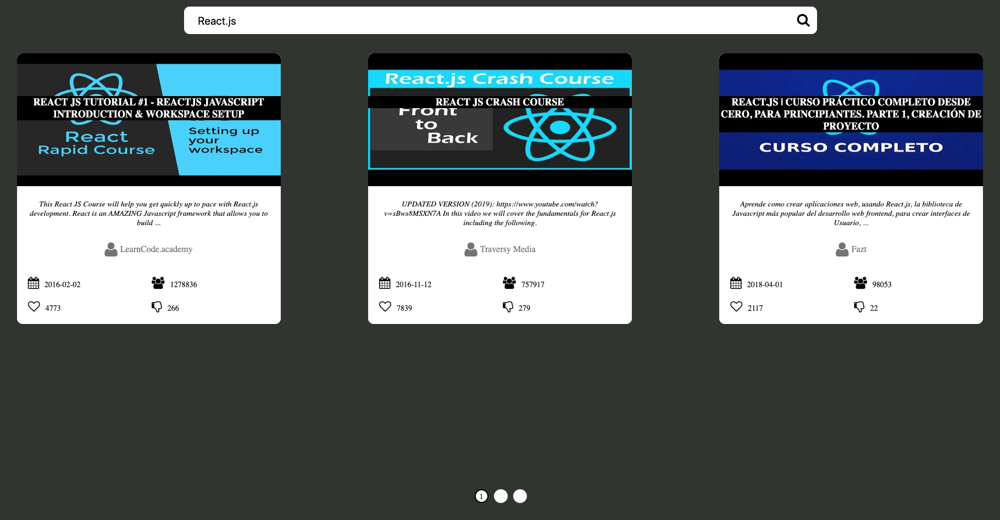
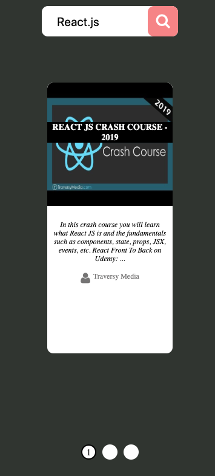

# YouTube Videos Search

## Short Description

Create a web app to view information about Youtube videos.

## Estimation (h)

32

## Topics

1. React
2. Redux
3. REST API

## Requirements

* Create a web page using React and Redux where users can search for
YouTube videos (display list results) using Youtube REST API.

1. Each item should have information about:

    - Title
    - Description
    - Rate
    - Preview (as a picture)
    - Etc...

2. All data should be loaded by chunks.
3. Progressive data loading by emulating infinite scrolling experience.
4. App's repo should have at least 5 commits.
5. Build whole app via webpack using babel.
6. Shared components as independent modules are required.

## Advanced Requirements

1. Results should be listed pagely. Note: After resize event the first item from previous state should be presented as a first item of new state.
2. App should support mobile browsers. See image below.

    

3. Results list should be scrolled via mouse swipe on desctop version and with swipe on mobile version.
4. Results list should have pagination.

## Common Mistakes and Questions

### Questions

    Q: Where can I find information about YouTube API?
    A: https://developers.google.com/youtube/v3/

    Q: Should I use Router for this App?
    A: No. It is enough to use only one page.

    Q: Can I use any redux middlewares for handling async actions?
    A: Of course. All async logic should be placed in middlewares.
